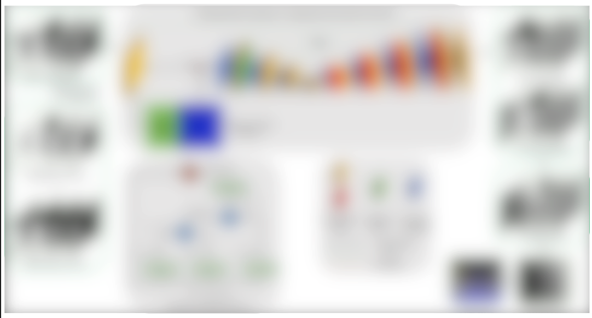
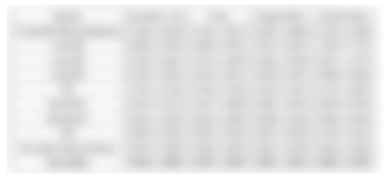
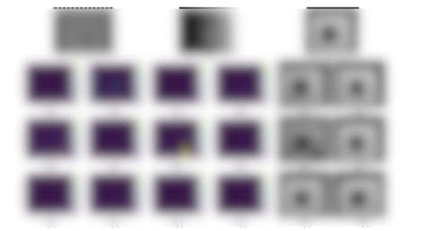
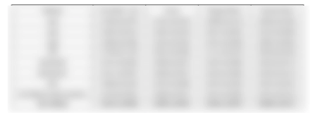
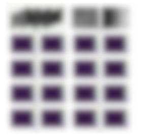
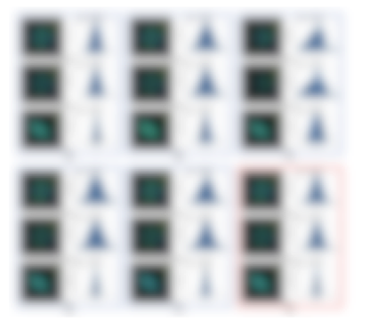

# Attention-Guided End-to-End Phase Calculation Network for Accurate High Dynamic Range 3D Reconstruction

##  Overview of AGPCN

AGPCN is a attention-guided, end-to-end phase calculation network in multi-frequency, multi-step, multi-exposure phase-shifting profilometry (PSP) 3D reconstruction for HDR objects.

  
  
Fig 1. Network_structure

## Dataset

we compile and release the metallic dataset with HDR problems used in this study. This dataset includes 1700 sets of data from various materials, shapes, standard, and non-standard parts, making it the largest structured light dataset to date.  Click <a href="https://wangh257.github.io/AGPCN/Data_Download.html">here</a>  to download the dataset.The types of defects and data distribution are shown.

  
  
Fig 2. matal_dataset

## Experimental results
### metal dataset 

  
Table 1. MAE of sine and cosine components, wrapped phase, and absolute phase.

  

  
  
Fig 3. matal dataset result

### ceramic dataset 

  
Table 1. MAE of sine and cosine components, wrapped phase, and absolute phase.

  

  
  
Fig 3. ceramic dataset result

### standard object 

  
Table 1. MAE and std of different methods on standard spheres with radii of 15.0086 mm and 12.6975 mm, and on a ceramic plane.

  

  
  
Fig 3. satndard object result

